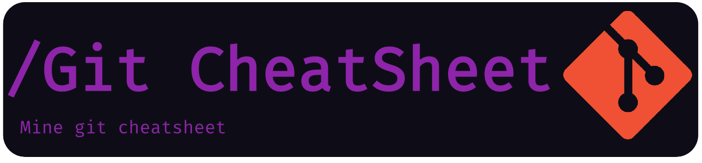

<!--  -->

<table width="100%" align="center" style="border:0;">
<tr style="display:flex; justify-content:space-around; paddind:0; border:0;">
<td colspan="2" style="padding:0; margin:0; text-align:center; border:0;">

<h1 style="margin:0; padding:0;">Ahmet ERYILMAZ</h1>
<small style="margin:0; padding:0;">Software Developer</small>

</td></tr>
<tr style="display:flex; justify-content:space-around; paddind:0;border:0;">
<td style="padding:0; margin:0;border:0;">

### Skills

</td><td style="padding:0; margin:0; border:0;">

### Socials

    

</td></tr>
</table>

<!--  -->

### There is my cheatsheets

### My github stats

<!--

-->

<!--
**kuvarti/kuvarti** is a ✨ _special_ ✨ repository because its `README.md` (this file) appears on your GitHub profile.

Here are some ideas to get you started:

- 🔭 I’m currently working on ...
- 🌱 I’m currently learning ...
- 👯 I’m looking to collaborate on ...
- 🤔 I’m looking for help with ...
- 💬 Ask me about ...
- 📫 How to reach me: ...
- 😄 Pronouns: ...
- ⚡ Fun fact: ...
-->
